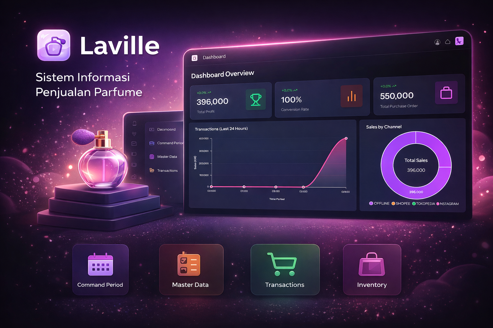

# 🌸 Laville - Sistem Informasi Penjualan Parfume

**Laville** adalah aplikasi web berbasis Laravel yang dirancang untuk membantu pengelolaan penjualan parfume secara modern, cepat, dan efisien.
Aplikasi ini menyediakan fitur monitoring penjualan, manajemen produk, transaksi, hingga analisis performa bisnis dalam satu dashboard yang user-friendly.

---

## ✨ Fitur Utama

* 📊 **Dashboard Overview**

    * Total Profit
    * Conversion Rate
    * Total Orders
    * Total Purchase
    * Grafik transaksi (real-time)
    * Sales by Channel (Offline, Shopee, Tokopedia, Instagram)
    * Dashboard data Daily, Weekly, Monthly, Yearly

* 🧾 **Manajemen Transaksi**

    * Pencatatan penjualan (Order & Pelanggan)
    * Riwayat transaksi
    * Tracking order

* 📦 **Inventory Management**

    * Order Pembelian (PO)
    * Penerimaan Barang
    * Pengeluaran Barang
    * Stock Opname
    * Kartu Stock

* 🗂️ **Master Data**

    * Data produk parfume
    * Konversi satuan produk per-unit
    * Supplier

* ⚙️ **Pengaturan Sistem**

    * Setting periode
    * Konfigurasi aplikasi

* 📈 **Analitik Penjualan**

    * Grafik performa penjualan

---

## 🧑‍💻 Tech Stack

* **Laravel v12**
* **InertiaJS with Vue.js**
* **PHP ≥ 8.2**
* **PostgreSQL**
* **Node.js & NPM**
* **Tailwind CSS**
* **Chart.js / ApexCharts**
* **Docker (Optional)**

---

## ⚙️ Prasyarat

Pastikan sudah menginstall:

* **PHP 8.2 atau lebih baru**
* **Composer (latest)**
* **Node.js (latest)**
* **Database (PostgreSQL)**
* **Laragon / XAMPP / sejenisnya**
* **Docker (Optional)**

---

## 🚀 Instalasi Versi Local

### 1. Clone Repository

```bash
git clone git@github.com:bimanyunugroho/laville.git
cd laville
```

### 2. Install Dependencies

```bash
composer install
npm install
```

### 3. Setup Environment

```bash
cp .env.local .env
```

Edit file `.env`:

```env
APP_NAME=Laville
APP_ENV=local
APP_KEY=
APP_DEBUG=true
APP_URL=http://laville.local
APP_TIMEZONE=Asia/Jakarta
``` 

---

### 4. Generate App Key

```bash
php artisan key:generate
```

---

### 5. Konfigurasi Database

```env
DB_CONNECTION=pgsql
DB_HOST=127.0.0.1
DB_PORT=5432
DB_DATABASE=laville_db
DB_USERNAME=postgres
DB_PASSWORD=
```

---

### 6. Migrasi & Seeder

```bash
php artisan migrate
php artisan db:seed
```

---

### 7. Jalankan Aplikasi

```bash
composer run dev
```

Akses di browser:

```
http://laville.local
```

---

## 🚀 Instalasi Versi Docker
**Note:** 
- Untuk proyek ini saya ada di lingkungan **Ubuntu**, jadi bisa saja kalau kalian pakai **Windows** kemungkinan akan sedikit berbeda. Jadi bisa disesuaikan saja ya.
- Pastikan **PORT 5433**  pada **Postgres** tidak digunakan, karena nantinya akan bentrok
- Kalau sudah digunakan **PORT 5433** bisa diubah dulu **docker-compose.yml** portnya misalkan 5439:5432 **(HOST PORT MESIN KAMU: HOST PORT CONTAINER BY DEFAULT 5432)**

### 1. Clone Repository

```bash
git clone git@github.com:bimanyunugroho/laville.git
cd laville
```

### 2. Setup Environment

```bash
cp .env.docker .env
```

### 3. Setup Docker

```bash
docker -v (Pastikan sudah terinstall dulu)

docker compose up -d --build
docker compose up -d
docker ps


- Pastikan sudah jalan semua container nya
- Untuk container laville_queue ini akan error karena belum di migrate database
- Nantinya akan normal kembali setelah di migrate
```

---

### 4. Setup App Laravel in Docker Tahap 1

```bash
docker exec -it laville_app bash
composer install
php artisan key:generate
php artisan migrate:refresh
php artisan db:seed
php artisan storage:link
npm ci && npm run build
chmod -R 777 storage bootstrap/cache
exit
```

---

### 5. Setup App Laravel in Docker Tahap 2

```bash
docker compose down -v
docker compose up -d
docker ps

- Semua container berjalan dengan normal setelah melakukan di point 4
```

---

### 5. Jalankan Aplikasi

Akses di browser:

```
http://localhost
```

---

## 🔑 Default Login

```
Email    : admin@gmail.com
Password : admin12345
```

---

## 📌 Struktur Fitur

* Dashboard → Monitoring bisnis
* Setting Periode → Set periode awal untuk transaksi
* Master Data → Data produk & Unit & Konversi produk by unit
* Transactions → Data pelanggan & penjualan
* Inventory → Stok barang
* Settings → Konfigurasi sistem

---

## 📄 Lisensi

© 2024 - 2024 @abisa.officiall - All Rights Reserved.

---
